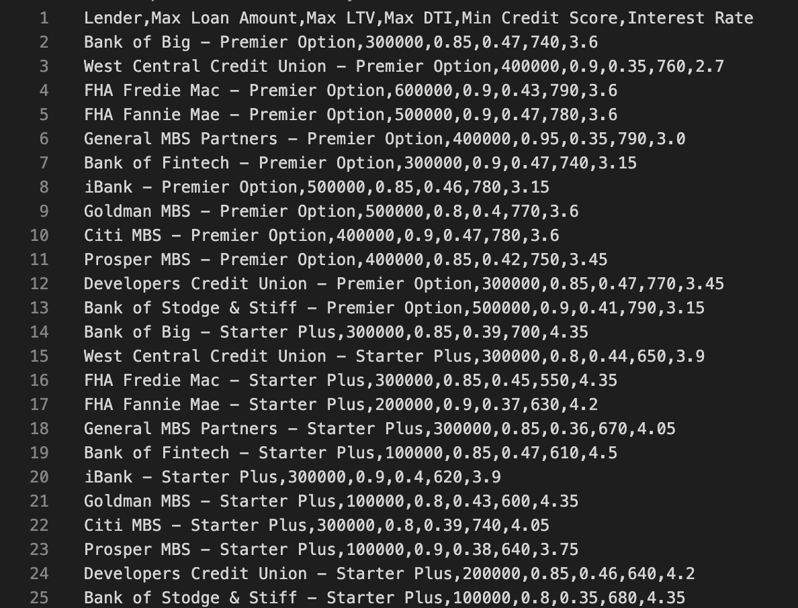
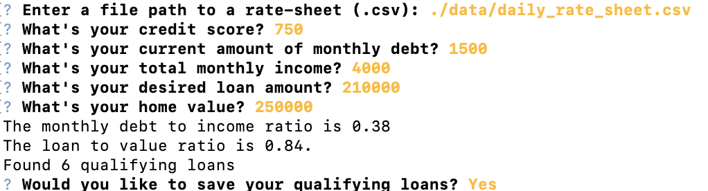
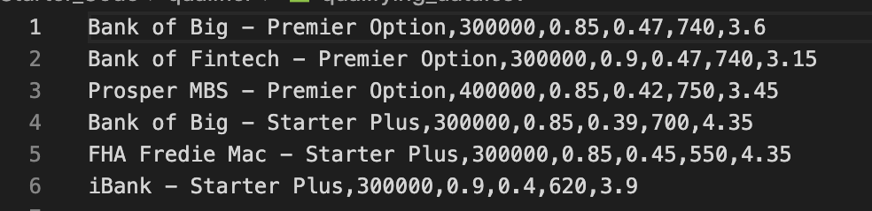

# Loan Qualifying Filter

The project is designed to filter out a list of bank loan based on users' desire. Users can enter their credit score, debt, income, desired loan, and home value to filter out a list of bank loans that is best for them.

---

## Technologies

It is required for users to have python.

---

## Installation Guide

There is no need to install.

---

## Examples

- ### This image describe a input of bank loan for filter to start.

- ### This image describe how the app process the bank loan in order to get best loans for users.

- ### This image describe what the filtered bank loan looks like

---

## Usage

---

## Contributors

Tong Huang

---

## License

When you share a project on a repository, especially a public one, it's important to choose the right license to specify others what they can and can not do with your source code and files. Use this section to include the licence you want to use.
